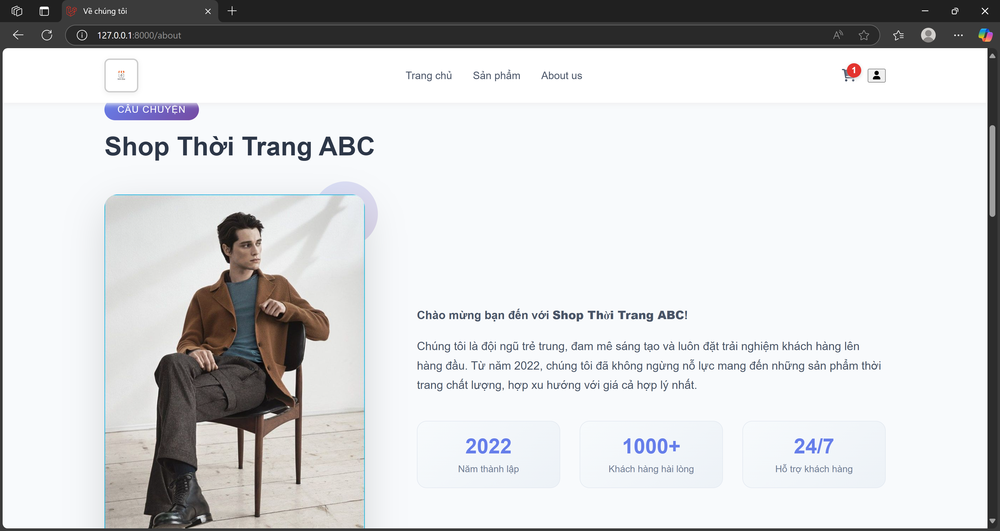

# :project website quản lý/ mua bán quần áo

## : Thông Tin Sinh Viên

- Họ và tên: Nguyễn Quang Huy
- Mã sinh viên: 23010731
- Lớp: K17_CNTT-8
- Môn học: Thiết kế Web nâng cao (COUR01.TH4)

## : Giới thiệu về Project

**Project xây dựng một website quản lý và bán quần áo **

- tiện lợi   
- Đáng tin cậy  

### : Chức năng chính

#### : Chức năng của Admin:

- : Quản lý sản phẩm (thêm, sửa, xóa sản phẩm)
- : Quản lý người dùng (xem, sửa, xóa người dùng)
- : Quản lý đơn hàng (xem, sửa, hủy, đơn hàng)

#### : Chức năng của Người dùng (User):

- : lọc sản phẩm theo giá
- : Thêm sản phẩm vào giỏ hàng, cập nhật/xóa sản phẩm trong giỏ
- : Đặt hàng, thanh toán đơn hàng
- : Cập nhật thông tin cá nhân

---

## : Công Nghệ Sử Dụng

- : PHP (Laravel)
- : MySQL (Aiven Cloud) 
- : Blade Template
- : HTML, CSS
- : Bootstrap

---

## : Cài Đặt

1. Clone Repository
```sh
https://github.com/nguyenquanghuyyy/shopbanquanao.git
cd shopbanquanao
```

2. Cài Đặt Dependencies PHP
```sh
composer install
npm install
npm run build
```

3. Cấu Hình Environment
```sh
cp .env.example .env
php artisan key:generate
php artisan migrate --seed
```

4. Khởi Động Development Server
```sh
php artisan serve
```

---
## Tài Khoản Đăng Nhập Mẫu

**1. Tài khoản Admin**  
- **Email:**  admin@example.com
- **Mật khẩu:** matkhaucuaban

**2. Tài khoản User**  
- **Email:** huyccht123@gmail.com 
- **Mật khẩu:** huy20112005

**Hoặc:**  
- Bạn có thể tự đăng ký một tài khoản mới bằng chức năng Đăng ký trên trang chủ.

---
## : Sơ đồ 

### :file_cabinet: Sơ đồ cấu trúc


#### 1. Các bảng chính

- **users**: Lưu thông tin tài khoản người dùng (admin và user): tên, email, mật khẩu, thời gian tạo/cập nhật, và phân quyền người dùng và admin dựa trên role v.v.
- **products**: Lưu thông tin của sản phẩm: id, tên, hình ảnh, giá cả, mô tả về sản phẩm, thời gian tạo.
- **carts**: Đại diện cho giỏ hàng của user lưu: id, user id, thời gian tạo.
- **cart_items**: Lưu các sản phẩm trong giỏ hàng: id sản phẩm, id giỏ hàng, thời gian tạo, số lượng.
- **orders**: Lưu thông tin đơn hàng của user: id, user id, tổng tiền, thời gian đặt hàng.
- **order_details**: Lưu chi các sản phẩm trong đơn hàng (id sản phẩm, id đơn hàng, số lượng, giá tại thời điểm đặt, thời gian tạo).


#### 2. Mối quan hệ giữa các bảng

- **users** 1---1 **carts**: Mỗi user mặc định chỉ 1 giỏ hàng đang hoạt động, khi nào tiến hàng đặt hàng xong thì giỏ hàng sẽ tự động làm trống.
- **carts** 1---n **cart_items**: Mỗi giỏ hàng có nhiều sản phẩm với số lượng khác nhau.
- **products** 1---n **cart_items**: Một sản phẩm có thể nằm trong nhiều giỏ hàng khác nhau.
- **users** 1---n **orders**: Mỗi user có thể đặt được nhiều đơn hàng.
- **orders** 1---n **order_details**: Một đơn hàng có nhiều sản phẩm.
- **products** 1---n **order_details**: Một sản phẩm có thể xuất hiện trong nhiều đơn hàng.


---

### : Sơ đồ thuật toán

- Admin quản lý sản phẩm (CRUD)  
  
- Admin quản lý tài khoản (CRUD)  
  
- Admin quản lý danh sách đơn hàng  
  
- User xem sản phẩm  
  
- User mua hàng, đặt hàng, thanh toán  
  
- Đăng nhập, đăng xuát
  

---

## Tổng Quan Kiến Trúc

### Kiến Trúc MVC

** Project áp dụng MVC (Model-View-Controller) của Laravel:**

- **Models:** định nghĩa, kết hợp với controller sử lý logic
- **Views:** Blade templates để render giao diện người dùng
- **Controllers:** Xử lý yêu cầu người dùng và phối hợp giữa models và views

### Các Thành Phần Chính

- **Controllers**  
  
- **Models**  
  
- **Views**  
  


### Routes

```php

<?php

use App\Http\Controllers\Admin\ProfileController;
use App\Http\Controllers\UserProfile;
use App\Http\Controllers\UserHomeController;
use App\Http\Controllers\UserOrderController;
use App\Http\Controllers\Admin\ProductController;
use App\Http\Controllers\UserProductController;
use App\Http\Controllers\CustomerController;
use Illuminate\Support\Facades\Route;
use App\Http\Controllers\Admin\UserController;
use App\Http\Controllers\Admin\OrderController;
use App\Http\Controllers\CartController;
use App\Http\Controllers\Auth\AuthController;
use App\Http\Controllers\Admin\OrderController as AdminOrderController;
use App\Http\Controllers\Admin\ProductController as AdminProductController;
use App\Http\Controllers\Admin\UserController as AdminUserController;

Route::middleware(['auth', 'admin'])->prefix('admin')->name('admin.')->group(function () {
    Route::resource('products', ProductController::class);
    Route::resource('users',  UserController::class);
    Route::resource('orders', OrderController::class);
    Route::get('profile', [ProfileController::class, 'edit'])->name('profile.edit');
    Route::post('profile', [ProfileController::class, 'update'])->name('profile.update');
});
Route::middleware(['auth'])->group(function () {
    Route::get('user/products', [UserProductController::class, 'index'])->name('user.products.index');
    Route::get('user/products/search', [UserProductController::class, 'search'])->name('user.products.search');
    Route::get('user/products/{product}', [UserProductController::class, 'show'])->name('user.products.show');

    Route::get('cart', [CartController::class, 'index'])->name('cart.index');
    Route::post('cart/add/{product}', [CartController::class, 'add'])->name('cart.add');
    Route::post('cart/update/{item}', [CartController::class, 'update'])->name('cart.update');
    Route::delete('cart/remove/{item}', [CartController::class, 'remove'])->name('cart.remove');

    Route::get('checkout', [UserOrderController::class, 'create'])->name('user.order.create');
    Route::post('checkout', [UserOrderController::class, 'store'])->name('user.order.store');
    Route::get('user/orders', [UserOrderController::class, 'index'])->name('user.orders.index');
    Route::get('user/orders/{order}', [UserOrderController::class, 'show'])->name('user.orders.show');
    Route::delete('user/orders/{order}', [UserOrderController::class, 'destroy'])->name('user.orders.destroy');

    Route::get('profile', [UserProfile::class, 'edit'])->name('user.profile.edit');
    Route::post('profile', [UserProfile::class, 'update'])->name('user.profile.update');
    Route::get('/about', function () {
    return view('user.about');})->name('about');
    Route::get('user/dashboard', [UserHomeController::class, 'index'])->name('user.dashboard');
});
// auth
Route::get('/', [AuthController::class, 'showLoginForm'])->name('login');
Route::post('login', [AuthController::class, 'login'])->name('login.post');
Route::get('register', [AuthController::class, 'showRegisterForm'])->name('register');
Route::post('register', [AuthController::class, 'register'])->name('register.post');
Route::post('logout', [AuthController::class, 'logout'])->name('logout');


Route::middleware(['auth', 'admin'])->get('admin/dashboard', function () {
    return view('admin.dashboard');
})->name('admin.dashboard');
```
---

## :framed_picture: Giao Diện Chính Website

1. Giao diện Đăng nhập/ Đăng ký
 
 
2. Giao diện của Admin  
- Quản lý tài khoản  
  
- Quản lý đơn hàng  
  
- Quản lý sản phẩm  
  
- Profile
  

3. Giao diện của User  
- Trang chủ  
  
- Trang sản phẩm  
  
- Trang aboutus 
  
- Trang cart  
  
- Profile  
  

---

## Code và giải thích 1 số chức năng chính
- Model cart
  
  + Định nghĩa cart với các thông tin và xử lý các logic liên quan
- Model Order
  
  + Định nghĩa order với các thông tin của nó và xử lý các logic về việc giỏ hàng ở thuộc user nào, giỏ hàng có các product nào
- Model Product
  
  + Định nghĩa product với các thông tin xử lý các logic liên quan
- Model User
  
  + Định nghĩa user với các thông tin và xử lý các logic liên quan
- Controller phần đặt hàng của user
  
  + Hàm index để trả về view cho phần order của user
  + Hàm create là để xử lý logic ấn vào nút đặt hàng trong phần giỏ hàng
  
  + Hàm show để gọi view cho phần xem đơn hàng
  + Hàm destroy để xử lý logic xóa đơn hàng và gọi view phần xóa đơn hàng
- Controller cho trang sản phẩm của user
  
  + Xử lý logic lọc sản phẩm và thêm vòa giỏ hàng đồng thời trả về trang view phần giỏ hàng khi ấn nút thêm vào giỏ hàng
- Controller phần quản lý user
  
  + Trả về view quản lý user
  + Xử lý logic cho việc sửa và xóa user
- Controller quản lý sản phẩm cho admin
  
  + Trả về view quản lý sản phẩm
  
  + Xử lý logic các phần thêm, sửa, xóa, xem sản phẩm
  
- Controller quản lý đơn hàng cho admin
  
  
  + Trả về view phần quản lý đơn hàng
  + Xử lý logic phần sửa, xóa, xem đơn hàng
 
---


** Liên kết


1. GitHub: https://github.com/nguyenquanghuyyy/shopbanquanao.git
2. Public Website: https://shopbanquanao.onrender.com
3. Link demo: https://drive.google.com/file/d/1LypnQ_CKxJzN1DvXRIUh7GEKd9IX3UIJ/view?usp=sharing
4. Vì link public website không thể tồn tại lâu nên nếu không dùng được link public thì thầy cô hãy copy repo trên github về máy và thực hiện các bước sau
- xóa file dockerfile, chỉnh sửa các dòng sau trong env APP_DEBUG=false APP_URL=http://localhost APP_ENV=local
- và chạy các dòng sau trong terminal composer install php artisan key:generate php artisan serve

